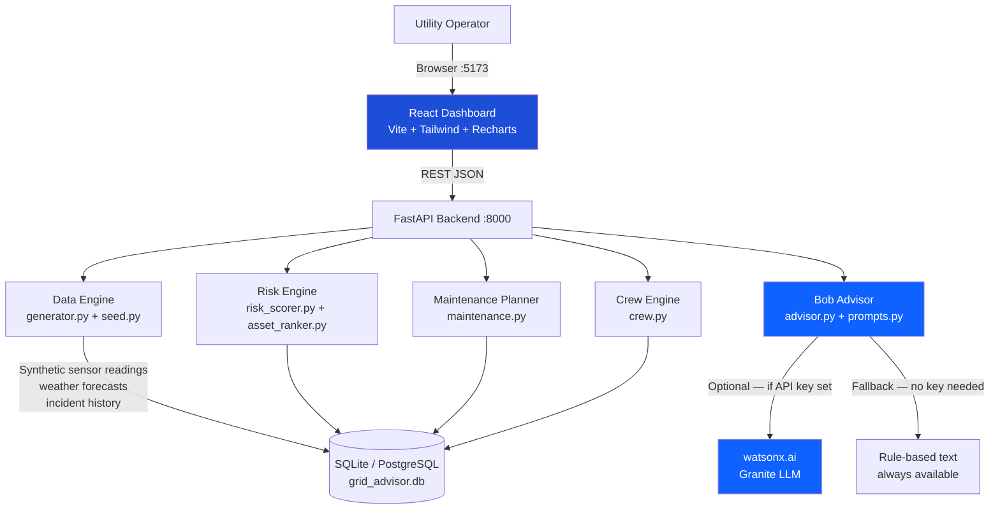

# Architecture

## System Architecture

The Power Outage Prediction & Grid Equipment Failure Advisor is a full-stack application consisting of a React dashboard, a FastAPI backend, a SQLite/PostgreSQL database, and an optional IBM watsonx.ai integration layer.

## Components

| Component | Technology | Responsibility |
|---|---|---|
| Frontend | React 18 + TypeScript + Vite + Tailwind + Recharts | Dashboard UI: risk ranking table, zone heatmap, sensor sparklines, maintenance plan, crew panel, Bob advisor panel |
| Backend API | FastAPI + SQLAlchemy | Data normalisation, risk scoring, asset ranking, recommendation generation, crew assignment, Bob orchestration |
| Risk Engine | Pure Python (IEEE/IEC grounded formula) | Composite risk scoring across temperature, vibration, partial discharge, oil quality, weather, incident history |
| AI Layer | watsonx.ai Granite (optional) | Natural-language briefings and asset explanations; rule-based fallback when no API key |
| Database | SQLite (default) / PostgreSQL | Grid asset catalogue, sensor readings, historical incidents, weather forecasts, crew roster |
| Bob Skill | `.bob/skills/grid-advisor.md` | IBM Bob in-IDE skill that wraps the API for judges using Bob directly |

## Data Flow

1. **Synthetic data generation** — `generator.py` creates 15 grid assets, 1,800 sensor readings (30 days × 4 intervals/day), 5-day weather forecasts per zone, and ~200 historical incidents. All values are grounded in IEEE C57.91, IEC 60270, ISO 10816 standards.
2. **Risk scoring** — `risk_scorer.py` normalises sensor readings, joins weather forecasts per zone, computes incident rate from history, and applies a weighted composite formula with age and load factors.
3. **Asset ranking** — `asset_ranker.py` multiplies risk score by grid impact factor (customers × capacity) and sorts descending to produce the priority list.
4. **Maintenance planning** — `maintenance.py` maps each severity label to a time-to-action rule and generates per-asset action cards with deadlines and required skills.
5. **Crew pre-positioning** — `crew.py` runs a greedy assignment algorithm to dispatch the nearest available crew to Critical assets, stage crews for High assets, and schedule for Medium assets.
6. **Bob briefing** — `advisor.py` sends the top-N ranked assets to watsonx.ai Granite for a natural-language operational briefing, or generates rule-based text if no API key is present.
7. **Dashboard** — React frontend polls the API every 60 seconds, displaying all outputs in a tabbed interface.

## API Surface

| Route | Method | Purpose |
|---|---|---|
| `/assets` | GET | Asset catalogue |
| `/assets/{id}/sensors` | GET | 7-day sensor readings |
| `/risk/ranking` | GET | Ranked asset list |
| `/risk/zones` | GET | Zone risk heatmap data |
| `/risk/summary` | GET | Dashboard header counts |
| `/maintenance/plan` | GET | Ordered maintenance actions |
| `/crew/positioning` | GET | Crew assignment list |
| `/bob/briefing` | POST | AI operational briefing |
| `/bob/explain/{id}` | GET | AI asset explanation |

## IBM Bob Integration (Load-Bearing)

Three integration points ensure Bob is genuinely used, not just mentioned:

1. **`POST /bob/briefing`** — sends structured JSON of top-N at-risk assets to watsonx.ai Granite and returns a plain-English morning briefing for the operations team.
2. **`GET /bob/explain/{asset_id}`** — asks the LLM to explain in plain English why a specific asset is at risk and what the operator should do, parsed into `explanation` and `recommended_action` fields.
3. **`.bob/skills/grid-advisor.md`** — a Bob skill file that judges can invoke directly inside IBM Bob IDE to query the running API conversationally.

## Security Considerations

- API keys and credentials are stored as environment variables, never committed to git.
- `.env` is in `.gitignore`; only `.env.example` is committed.
- The app is designed for local/internal utility network use; production deployment should add authentication middleware and HTTPS.

## Scalability Notes

- Swap `DATABASE_URL` from SQLite to PostgreSQL for multi-user or production use with no code changes.
- The risk engine is stateless and can be deployed as a serverless function (IBM Cloud Functions) triggered by sensor stream events.
- The synthetic generator can be replaced with a real sensor ingestion adapter without changing the scoring or ranking logic.
