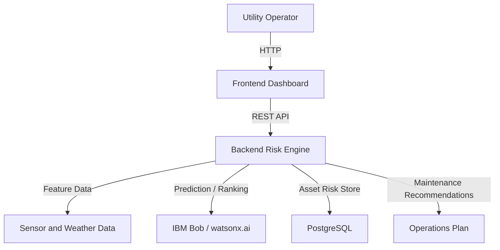

# Architecture

## System Architecture

The Power Outage Prediction & Grid Equipment Failure Advisor receives asset sensor feeds, weather forecast information, and incident history from utility operations data sources. A Python or API backend coordinates feature preparation and risk ranking, while the dashboard shows vulnerable assets, outage-prone zones, health scores, and recommended response actions.

## Components

| Component | Technology | Responsibility |
|---|---|---|
| Frontend | React | Dashboard UI for assets, weather trends, outage risk, and recommendations |
| Backend API | FastAPI | Data normalization, ranking, recommendation generation, and APIs |
| AI / ML | watsonx.ai / IBM Bob | Predictive scoring and explainable incident-risk reasoning |
| Database | PostgreSQL | Stores grid asset health signals, forecasts, risk scores, and recommendations |
| Data Sources | Weather Feed, Sensor Feed, Incident History | Input signals that feed the outage risk engine |

## Data Flow

1. Grid assets emit sensor readings such as temperature, vibration, partial discharge, and oil condition.
2. Weather forecast and historical incident data are joined with current asset health values.
3. The backend computes health and outage-risk indicators for each asset and region.
4. Assets are ranked by risk and impact severity for grid operations planning.
5. Recommended maintenance and crew pre-positioning actions are shown in the dashboard.

## Security Considerations

- API keys and provider credentials are intended to be stored as environment variables rather than committed to git.
- Dashboard and backend access should be limited to authorized utility operations staff.
- Sensitive grid and infrastructure data should be protected with secure audit and access logging.

## Scalability Notes

The prototype can be extended to a real-time event stream, where sensor data is updated continuously and operating decisions are recomputed as conditions evolve. A production deployment should add monitoring, alert policies, and retraining workflows for the risk model.
